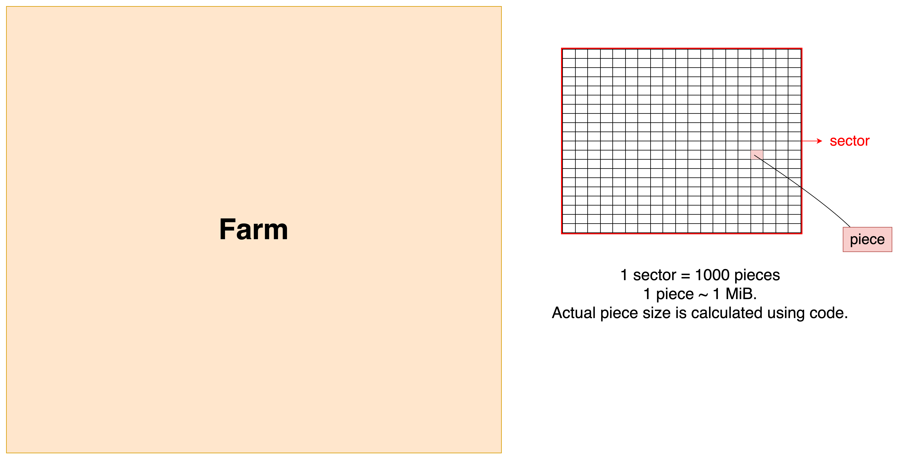

# Subspace Consensus v2

## Solution Range

In the Subspace Dilithium Consensus Specification v2, `SolutionRange` is a parameter for the proof-of-replication challenge. It's initially set to a value defined by `INITIAL_SOLUTION_RANGE` for the first era. The `SolutionRange` is dynamically adjusted every era (defined by `ERA_DURATION_IN_BLOCKS`), based on the actual and expected blocks produced per era to maintain a consistent block production rate as the space pledged on the network changes. The new `SolutionRange` for an era is calculated as: `next_solution_range = max(min( era_slot_count / ERA_DURATION_IN_BLOCKS * SLOT_PROBABILITY, 4), 1/4) * current_solution_range`.

Here is the formula to calculate `SolutionRange` for a given no. of era & previous solution range value:

`next_solution_range = max(min( era_slot_count / ERA_DURATION_IN_BLOCKS * SLOT_PROBABILITY, 4), 1/4) * current_solution_range`

For a given no. of sectors, the solution range can be calculated based on this formula:

```rust
/// Computes the following:
/// ```
/// MAX * slot_probability / (pieces_in_sector * chunks / s_buckets) / sectors
/// ```
const fn sectors_to_solution_range(sectors: u64) -> SolutionRange {
    let solution_range = SolutionRange::MAX
        // Account for slot probability
        / SLOT_PROBABILITY.1 * SLOT_PROBABILITY.0
        // Now take sector size and probability of hitting occupied s-bucket in sector into account
        / (MAX_PIECES_IN_SECTOR as u64 * Record::NUM_CHUNKS as u64 / Record::NUM_S_BUCKETS as u64);

    // Take number of sectors into account
    solution_range / sectors
}

/// Computes the following:
/// ```
/// MAX * slot_probability / (pieces_in_sector * chunks / s_buckets) / solution_range
/// ```
const fn solution_range_to_sectors(solution_range: SolutionRange) -> u64 {
    let sectors = SolutionRange::MAX
        // Account for slot probability
        / SLOT_PROBABILITY.1 * SLOT_PROBABILITY.0
        // Now take sector size and probability of hitting occupied s-bucket in sector into account
        / (MAX_PIECES_IN_SECTOR as u64 * Record::NUM_CHUNKS as u64 / Record::NUM_S_BUCKETS as u64);

    // Take solution range into account
    sectors / solution_range
}
```

And viceversa can also be calculated i.e. calculate sectors for a given solution range.

## Total Space Pledged

Now, if you have `SolutionRange`, then you can calculate `TotalSpacePledged` as:

```rust
pub struct TotalSpacePledged;

impl Get<u128> for TotalSpacePledged {
    fn get() -> u128 {
        // Operations reordered to avoid data loss, but essentially are:
        // u64::MAX * SlotProbability / (solution_range / PIECE_SIZE)
        u128::from(u64::MAX)
            .saturating_mul(Piece::SIZE as u128)
            .saturating_mul(u128::from(SlotProbability::get().0))
            / u128::from(Subspace::solution_ranges().current)
            / u128::from(SlotProbability::get().1)
    }
}
```

## Farm

A farm is a collection of sectors where each sector has N (max. 1000 in the [code](https://github.com/subspace/subspace/blob/8fff19cb8532f39fa670e13dd629c024350c8010/crates/subspace-runtime/src/lib.rs#L101-L102) for now) pieces, where each piece is of almost $\gtrapprox$ 1 MiB (Mebibyte = 2^20 bytes). The piece size is actually calculated as per this code:

[Source code](https://github.com/subspace/subspace/blob/main/crates/subspace-core-primitives/src/pieces.rs#L801)

```rust
impl Piece {
    pub const SIZE: usize = Record::SIZE + RecordCommitment::SIZE + RecordWitness::SIZE;
}
```

> We would use N = 1000 for calculation of no. of sectors below.



Now, if a farm is of size 2 GB, then it should have sectors = 2GB / (1000 * 2^20) = 1.907... means 1 sector & 907 pieces.<br/>
But, out of 2 GB, 1 full sector of size ~ 1 GiB is actually farmed. And rest includes metadata and some left over empty space.

Q. By the way, the minimum farm size is set as `2 GB`. And why so? <br/>
Because a full sector + metadata would not fit into a plot < 2 GB. So, at least 2 GB plot/farm size is required.

Here are the key takeaways:

- A piece has size of $\gtrapprox$ 1 MiB
- A sector has size of ~ 1.3 GB
- A farm/plot has min. required size of 2 GB

## References

- [Subspace Dilithium Consensus Specification](https://subspacelabs.notion.site/Subspace-Dilithium-Consensus-Specification-v2-3-274a730b53eb4c93a8d879b90de532ce#24a718a13e434417a72ead964f073631)
