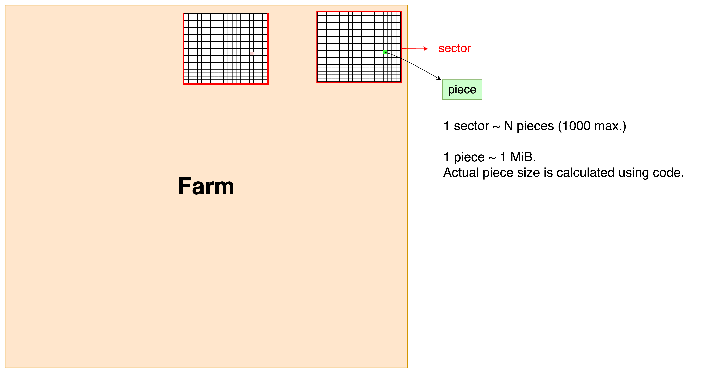

# Subspace Consensus v2

## Solution Range

In the Subspace Dilithium Consensus Specification v2, `SolutionRange` is a parameter for the proof-of-replication challenge. It's initially set to a value defined by `INITIAL_SOLUTION_RANGE` for the first era. The `SolutionRange` is dynamically adjusted every era (defined by `ERA_DURATION_IN_BLOCKS`), based on the actual and expected blocks produced per era to maintain a consistent block production rate as the space pledged on the network changes. The new `SolutionRange` for an era is calculated as: `next_solution_range = max(min( era_slot_count / ERA_DURATION_IN_BLOCKS * SLOT_PROBABILITY, 4), 1/4) * current_solution_range`.

The era is defined as `2016` blocks. So, the solution range changes every `2016` blocks.
> ERA_DURATION_IN_BLOCKS = 2016. [Source](https://github.com/subspace/subspace/blob/5f6132956dc93dce079f66d8a3319627ae20a2f9/crates/subspace-runtime/src/lib.rs#L173-L174).

To determine the next solution range, the average of the last 2016 blocks are considered. And then it's adjusted (increased or decreased) to ensure the block production rate is consistent (with 6 seconds per block) with the space pledged on the network.
> This is pretty much like Bitcoin's difficulty level adjustment to keep the block production consistent with 10 mins per block.

Here is the formula to calculate `SolutionRange` for a given no. of era & previous solution range value:

`next_solution_range = max(min( era_slot_count / ERA_DURATION_IN_BLOCKS * SLOT_PROBABILITY, 4), 1/4) * current_solution_range`

For a given no. of sectors, the solution range can be calculated based on this formula:

```rust
/// Computes the following:
/// ```
/// MAX * slot_probability / (pieces_in_sector * chunks / s_buckets) / sectors
/// ```
const fn sectors_to_solution_range(sectors: u64) -> SolutionRange {
    let solution_range = SolutionRange::MAX
        // Account for slot probability
        / SLOT_PROBABILITY.1 * SLOT_PROBABILITY.0
        // Now take sector size and probability of hitting occupied s-bucket in sector into account
        / (MAX_PIECES_IN_SECTOR as u64 * Record::NUM_CHUNKS as u64 / Record::NUM_S_BUCKETS as u64);

    // Take number of sectors into account
    solution_range / sectors
}

/// Computes the following:
/// ```
/// MAX * slot_probability / (pieces_in_sector * chunks / s_buckets) / solution_range
/// ```
const fn solution_range_to_sectors(solution_range: SolutionRange) -> u64 {
    let sectors = SolutionRange::MAX
        // Account for slot probability
        / SLOT_PROBABILITY.1 * SLOT_PROBABILITY.0
        // Now take sector size and probability of hitting occupied s-bucket in sector into account
        / (MAX_PIECES_IN_SECTOR as u64 * Record::NUM_CHUNKS as u64 / Record::NUM_S_BUCKETS as u64);

    // Take solution range into account
    sectors / solution_range
}
```

And viceversa can also be calculated i.e. calculate sectors for a given solution range.

## Total Space Pledged

Now, if you have `SolutionRange`, then you can calculate `TotalSpacePledged` as:

```rust
pub struct TotalSpacePledged;

impl Get<u128> for TotalSpacePledged {
    fn get() -> u128 {
        // Operations reordered to avoid data loss, but essentially are:
        // u64::MAX * SlotProbability / (solution_range / PIECE_SIZE)
        u128::from(u64::MAX)
            .saturating_mul(Piece::SIZE as u128)
            .saturating_mul(u128::from(SlotProbability::get().0))
            / u128::from(Subspace::solution_ranges().current)
            / u128::from(SlotProbability::get().1)
    }
}
```

> FACT:
> The total space pledged is actually not calculated as sum of all farms by all of the farmers in the network. It's calculated probabilistically by frequency with which blocks are produced.

E.g: Consider a scenario with a single farmer who has pledged one sector consisting of `1000 pieces`, approximately `1 GiB`. We aim to produce a block every `6 seconds`, which implies that the farmer should have a `1/6 probability` per second of producing a block with one of his `1000 pieces`.

This sets the threshold at`1/(6*1000) times the total possible solutions`.

After observing for `2016 blocks`, we find that the farmer is producing blocks every `3 seconds`, rather than the desired `6 seconds`. To correct this, we need to halve the solution range and adjust our assumption to reflect that the farmer has actually pledged `2 GiB`.

This process should be scaled accordingly with more farmers.

## Farm/Plot

A farm/plot is a collection of sectors where each sector has N (max. 1000 in the [code](https://github.com/subspace/subspace/blob/8fff19cb8532f39fa670e13dd629c024350c8010/crates/subspace-runtime/src/lib.rs#L101-L102) for now) pieces, where each piece is of almost $\gtrapprox$ 1 MiB (Mebibyte = 2^20 bytes). The piece size is actually calculated as per this code:

[Source code](https://github.com/subspace/subspace/blob/main/crates/subspace-core-primitives/src/pieces.rs#L801)

```rust
impl Piece {
    pub const SIZE: usize = Record::SIZE + RecordCommitment::SIZE + RecordWitness::SIZE;
}
```

> We would use N = 1000 for calculation of no. of sectors below.



Now, if a farm is of size 2 GB, then it should have sectors = 2GB / (1000 * 2^20) = 1.907... means 1 sector & 907 pieces.<br/>
But, out of 2 GB, 1 full sector of size ~ 1 GiB is actually farmed. And rest includes metadata and some left over empty space.

Q. By the way, the minimum farm size is set as `2 GB`. And why so? <br/>
Because a full sector + metadata would not fit into a plot < 2 GB. So, at least 2 GB plot/farm size is required.

Here are the key takeaways:

- A piece has size of $\gtrapprox$ 1 MiB
- A sector has size of ~ 1.3 GB
- A farm/plot has min. required size of 2 GB

### Farming, Sectors & Pieces

These are related to the consensus mechanism of the Subspace network, which is a storage-based blockchain system. Here's how they relate to each other:

- **Farming**: Farming refers to the process of participating in the consensus mechanism by storing data and solving challenges based on the data stored. Farmers compete to solve these puzzles (i.e. submit proof of replication) and earn rewards. Farming involves maintaining plots on disk that contain sectors with pieces of blockchain history ([docs/consensus/consensus/farming.md](https://github.com/subspace/subnomicon/blob/626848b9e3f4e09e87ce8fb95985f61a935a0d83/docs/consensus/consensus/farming.md)).
- **Sectors**: Sectors are subdivisions of a farmer's plot. They are equally-sized storage units on disk, currently around 1 GiB each, containing a pseudorandom selection of pieces ([docs/consensus/consensus/plotting.md](https://github.com/subspace/subnomicon/blob/626848b9e3f4e09e87ce8fb95985f61a935a0d83/docs/consensus/consensus/plotting.md)). A plot consists of multiple sectors.
- **Pieces**: Pieces are the basic units of measurement in archived blockchain history. They consist of blockchain data (record), a KZG commitment, and a witness. Pieces are encoded and stored in sectors on a farmer's disk ([docs/consensus/consensus/archiving.md](https://github.com/subspace/subnomicon/blob/626848b9e3f4e09e87ce8fb95985f61a935a0d83/docs/consensus/consensus/archiving.md)).

The relationship is as follows: farmers create plots on their storage devices, which are divided into sectors. Each sector contains a number of encoded pieces that represent parts of the blockchain's history. The farmers use these sectors and the pieces within them to participate in the farming process, which is central to the network's consensus mechanism.

## References

- [Subspace Dilithium Consensus Specification](https://subspacelabs.notion.site/Subspace-Dilithium-Consensus-Specification-v2-3-274a730b53eb4c93a8d879b90de532ce#24a718a13e434417a72ead964f073631)
