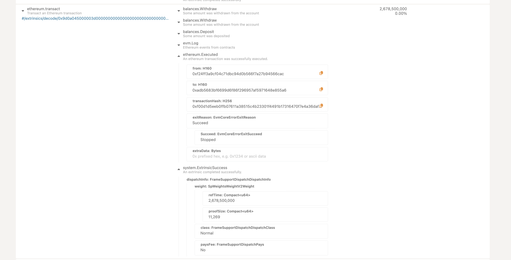

# Subspace Devnet

## Description

Subspace Devnet is a network setup which can be quickly launched by any developer to see the network running locally.

First we need to have the binaries: `subspace-node`, `subspace-farmer`.

Just clone the subspace monorepo & build the node binaries:

```sh
cargo b -r --bin subspace-node
cargo b -r --bin subspace-farmer
```

Or,

Download the "subspace-node-macos-aarch64-gemini-3h-2024-may-06.zip" (say) from the [releases page](https://github.com/subspace/subspace/releases/tag/gemini-3h-2024-may-06). And then extract the binaries into your preferred folder (say, `~/Downloads/subspace`).

---

Devnet could be started in 2 modes:

### A. Only consensus chain

- Run the subspace node

```sh
target/release/subspace-node run --dev
# or
~/Downloads/subspace/subspace-node run --dev
```

<details><summary>Expand:</summary>

Now, on subspace node terminal:

```sh
2024-06-18T12:49:33.488216Z  INFO Consensus: substrate: 💤 Idle (0 peers), best: #0 (0x1c05…78fe), finalized #0 (0x1c05…78fe), ⬇ 0 ⬆ 0    
2024-06-18T12:49:38.493352Z  INFO Consensus: substrate: 💤 Idle (0 peers), best: #0 (0x1c05…78fe), finalized #0 (0x1c05…78fe), ⬇ 0 ⬆ 0    
2024-06-18T12:49:43.498495Z  INFO Consensus: substrate: 💤 Idle (0 peers), best: #0 (0x1c05…78fe), finalized #0 (0x1c05…78fe), ⬇ 0 ⬆ 0    
2024-06-18T12:49:48.499937Z  INFO Consensus: substrate: 💤 Idle (0 peers), best: #0 (0x1c05…78fe), finalized #0 (0x1c05…78fe), ⬇ 0 ⬆ 0    
2024-06-18T12:49:53.505090Z  INFO Consensus: substrate: 💤 Idle (0 peers), best: #0 (0x1c05…78fe), finalized #0 (0x1c05…78fe), ⬇ 0 ⬆ 0    
2024-06-18T12:49:58.510225Z  INFO Consensus: substrate: 💤 Idle (0 peers), best: #0 (0x1c05…78fe), finalized #0 (0x1c05…78fe), ⬇ 0 ⬆ 0    
2024-06-18T12:50:03.515351Z  INFO Consensus: substrate: 💤 Idle (0 peers), best: #0 (0x1c05…78fe), finalized #0 (0x1c05…78fe), ⬇ 0 ⬆ 0    
2024-06-18T12:50:08.520473Z  INFO Consensus: substrate: 💤 Idle (0 peers), best: #0 (0x1c05…78fe), finalized #0 (0x1c05…78fe), ⬇ 0 ⬆ 0    
2024-06-18T12:50:13.522240Z  INFO Consensus: substrate: 💤 Idle (0 peers), best: #0 (0x1c05…78fe), finalized #0 (0x1c05…78fe), ⬇ 0 ⬆ 0    
2024-06-18T12:50:18.527366Z  INFO Consensus: substrate: 💤 Idle (0 peers), best: #0 (0x1c05…78fe), finalized #0 (0x1c05…78fe), ⬇ 0 ⬆ 0    
2024-06-18T12:50:23.528733Z  INFO Consensus: substrate: 💤 Idle (0 peers), best: #0 (0x1c05…78fe), finalized #0 (0x1c05…78fe), ⬇ 0 ⬆ 0    
2024-06-18T12:50:28.533864Z  INFO Consensus: substrate: 💤 Idle (0 peers), best: #0 (0x1c05…78fe), finalized #0 (0x1c05…78fe), ⬇ 0 ⬆ 0  
```

</details>

- Run the farmer node (in another terminal)

```sh
target/release/subspace-farmer farm --reward-address st7EWm3Y7KBwwX5X7Udz574k5A2d4ybpPfFqJN5Bv1Z2bnnh7 path=/Users/abhi3700/autosdk/farm,size=2GB
```

After the 2nd step, the blocks will start producing & getting finalized (None on 1 farmer) as more farmers join.

<details><summary>Expand:</summary>

On subspace node terminal:

```sh
2024-06-18T13:08:17.407803Z  INFO Consensus: sc_basic_authorship::basic_authorship: 🎁 Prepared block for proposing at 67 (0 ms) [hash: 0x2bd43f7b0dab9ab7feab1c749d287c5c2ddfdffbbfe949df4d0498e1006d1170; parent_hash: 0xee16…1891; extrinsics (1): [0x0845…13c8]    
2024-06-18T13:08:17.408189Z  INFO Consensus: subspace: 🔖 Pre-sealed block for proposal at 67. Hash now 0xdb62f5617f5280744fe491867b2ba19776656bcd541e84793acb76b9dafe955e, previously 0x2bd43f7b0dab9ab7feab1c749d287c5c2ddfdffbbfe949df4d0498e1006d1170.    
2024-06-18T13:08:17.408440Z  INFO Consensus: substrate: ✨ Imported #67 (0xdb62…955e)    
2024-06-18T13:08:19.316569Z  INFO Consensus: substrate: 💤 Idle (0 peers), best: #67 (0xdb62…955e), finalized #0 (0x1c05…78fe), ⬇ 0 ⬆ 0    
2024-06-18T13:08:24.318836Z  INFO Consensus: substrate: 💤 Idle (0 peers), best: #67 (0xdb62…955e), finalized #0 (0x1c05…78fe), ⬇ 0 ⬆ 0    
2024-06-18T13:08:27.909791Z  INFO Consensus: sc_consensus_subspace::slot_worker: 🚜 Claimed block at slot slot=2045
2024-06-18T13:08:27.909816Z  INFO Consensus: sc_basic_authorship::basic_authorship: 🙌 Starting consensus session on top of parent 0xdb62f5617f5280744fe491867b2ba19776656bcd541e84793acb76b9dafe955e    
2024-06-18T13:08:27.910608Z  INFO Consensus: sc_basic_authorship::basic_authorship: 🎁 Prepared block for proposing at 68 (0 ms) [hash: 0x377fb84ce0d6c9f0ee7ba833198f634a4a0938966244cf78e76da78741d912f5; parent_hash: 0xdb62…955e; extrinsics (1): [0xbcff…5e5d]    
2024-06-18T13:08:27.910973Z  INFO Consensus: subspace: 🔖 Pre-sealed block for proposal at 68. Hash now 0x457941faeab631357f81d0febd0a9cb4ffd4834a69506ef9aa53cccb6995acfb, previously 0x377fb84ce0d6c9f0ee7ba833198f634a4a0938966244cf78e76da78741d912f5.    
2024-06-18T13:08:27.911336Z  INFO Consensus: substrate: ✨ Imported #68 (0x4579…acfb)    
2024-06-18T13:08:29.320778Z  INFO Consensus: substrate: 💤 Idle (0 peers), best: #68 (0x4579…acfb), finalized #0 (0x1c05…78fe), ⬇ 0 ⬆ 0    
2024-06-18T13:08:34.320931Z  INFO Consensus: substrate: 💤 Idle (0 peers), best: #68 (0x4579…acfb), finalized #0 (0x1c05…78fe), ⬇ 0 ⬆ 0    
2024-06-18T13:08:38.621213Z  INFO Consensus: sc_consensus_subspace::slot_worker: 🚜 Claimed block at slot slot=2060
2024-06-18T13:08:38.621236Z  INFO Consensus: sc_basic_authorship::basic_authorship: 🙌 Starting consensus session on top of parent 0x457941faeab631357f81d0febd0a9cb4ffd4834a69506ef9aa53cccb6995acfb    
2024-06-18T13:08:38.622077Z  INFO Consensus: sc_basic_authorship::basic_authorship: 🎁 Prepared block for proposing at 69 (0 ms) [hash: 0x49dbb904e24693383f47c9b974f391d9d0cfedaf50501f76ae91c9c1c97c6da6; parent_hash: 0x4579…acfb; extrinsics (1): [0x5a82…a179]    
2024-06-18T13:08:38.622442Z  INFO Consensus: subspace: 🔖 Pre-sealed block for proposal at 69. Hash now 0xbea663ecb5b748e012f9d51b427b3903e5a1834ff2bfb86e66e7132aaa96d3d2, previously 0x49dbb904e24693383f47c9b974f391d9d0cfedaf50501f76ae91c9c1c97c6da6.    
2024-06-18T13:08:38.622710Z  INFO Consensus: substrate: ✨ Imported #69 (0xbea6…d3d2)    
2024-06-18T13:08:39.321114Z  INFO Consensus: substrate: 💤 Idle (0 peers), best: #69 (0xbea6…d3d2), finalized #0 (0x1c05…78fe), ⬇ 0 ⬆ 0    
2024-06-18T13:08:44.269742Z  INFO Consensus: sc_consensus_subspace::slot_worker: 🚜 Claimed block at slot slot=2068
2024-06-18T13:08:44.269760Z  INFO Consensus: sc_basic_authorship::basic_authorship: 🙌 Starting consensus session on top of parent 0xbea663ecb5b748e012f9d51b427b3903e5a1834ff2bfb86e66e7132aaa96d3d2    
2024-06-18T13:08:44.270507Z  INFO Consensus: sc_basic_authorship::basic_authorship: 🎁 Prepared block for proposing at 70 (0 ms) [hash: 0x34f77bfe36ecb955ccd4be6729ce818b63b1e3b3da7a0375fd7a248acdfbebd2; parent_hash: 0xbea6…d3d2; extrinsics (1): [0xac75…99a7]    
2024-06-18T13:08:44.270896Z  INFO Consensus: subspace: 🔖 Pre-sealed block for proposal at 70. Hash now 0x862592c2aa812532331cd9e79879675fcc6da146067da1bf6cf4eb2e40215d2f, previously 0x34f77bfe36ecb955ccd4be6729ce818b63b1e3b3da7a0375fd7a248acdfbebd2.    
2024-06-18T13:08:44.271163Z  INFO Consensus: substrate: ✨ Imported #70 (0x8625…5d2f)    
2024-06-18T13:08:44.321265Z  INFO Consensus: substrate: 💤 Idle (0 peers), best: #70 (0x8625…5d2f), finalized #0 (0x1c05…78fe), ⬇ 0 ⬆ 0    
2024-06-18T13:08:49.326513Z  INFO Consensus: substrate: 💤 Idle (0 peers), best: #70 (0x8625…5d2f), finalized #0 (0x1c05…78fe), ⬇ 0 ⬆ 0    
2024-06-18T13:08:49.921140Z  INFO Consensus: sc_consensus_subspace::slot_worker: 🚜 Claimed block at slot slot=2076
2024-06-18T13:08:49.921161Z  INFO Consensus: sc_basic_authorship::basic_authorship: 🙌 Starting consensus session on top of parent 0x862592c2aa812532331cd9e79879675fcc6da146067da1bf6cf4eb2e40215d2f    
2024-06-18T13:08:49.921836Z  INFO Consensus: sc_basic_authorship::basic_authorship: 🎁 Prepared block for proposing at 71 (0 ms) [hash: 0xa5947633259222818ded174ff8a8de1801c4370e2ceb3c431784d0f6f13378c0; parent_hash: 0x8625…5d2f; extrinsics (1): [0xbc80…7eff]    
2024-06-18T13:08:49.922227Z  INFO Consensus: subspace: 🔖 Pre-sealed block for proposal at 71. Hash now 0x100f9a4ab471800149d65dcb0dd4b026fe3197140f4820bda18308000d2a957e, previously 0xa5947633259222818ded174ff8a8de1801c4370e2ceb3c431784d0f6f13378c0.    
2024-06-18T13:08:49.922574Z  INFO Consensus: substrate: ✨ Imported #71 (0x100f…957e)    
2024-06-18T13:08:52.032883Z  INFO Consensus: sc_consensus_subspace::slot_worker: 🚜 Claimed block at slot slot=2079
2024-06-18T13:08:52.032901Z  INFO Consensus: sc_basic_authorship::basic_authorship: 🙌 Starting consensus session on top of parent 0x100f9a4ab471800149d65dcb0dd4b026fe3197140f4820bda18308000d2a957e    
2024-06-18T13:08:52.033535Z  INFO Consensus: sc_basic_authorship::basic_authorship: 🎁 Prepared block for proposing at 72 (0 ms) [hash: 0x49ee0a07b5f3304778e849450ac31eebf2c6bdaf3b7a4f1def650f8b874fffac; parent_hash: 0x100f…957e; extrinsics (1): [0xeb23…44a3]    
2024-06-18T13:08:52.033866Z  INFO Consensus: subspace: 🔖 Pre-sealed block for proposal at 72. Hash now 0x52bc73335c1c0cadccfe41a90f5d12511a15d54eaf61b6f43894bf3fb11898c8, previously 0x49ee0a07b5f3304778e849450ac31eebf2c6bdaf3b7a4f1def650f8b874fffac.    
2024-06-18T13:08:52.034111Z  INFO Consensus: substrate: ✨ Imported #72 (0x52bc…98c8)    
2024-06-18T13:08:54.329921Z  INFO Consensus: substrate: 💤 Idle (0 peers), best: #72 (0x52bc…98c8), finalized #0 (0x1c05…78fe), ⬇ 0 ⬆ 0    
2024-06-18T13:08:59.330780Z  INFO Consensus: substrate: 💤 Idle (0 peers), best: #72 (0x52bc…98c8), finalized #0 (0x1c05…78fe), ⬇ 0 ⬆ 0    
2024-06-18T13:09:04.335936Z  INFO Consensus: substrate: 💤 Idle (0 peers), best: #72 (0x52bc…98c8), finalized #0 (0x1c05…78fe), ⬇ 0 ⬆ 0    
2024-06-18T13:09:05.952460Z  INFO Consensus: sc_consensus_subspace::slot_worker: 🚜 Claimed block at slot slot=2099
2024-06-18T13:09:05.952485Z  INFO Consensus: sc_basic_authorship::basic_authorship: 🙌 Starting consensus session on top of parent 0x52bc73335c1c0cadccfe41a90f5d12511a15d54eaf61b6f43894bf3fb11898c8    
2024-06-18T13:09:05.953311Z  INFO Consensus: sc_basic_authorship::basic_authorship: 🎁 Prepared block for proposing at 73 (0 ms) [hash: 0x11c3c1a4c53d79b845ff7243fdd96786abaf09fc322e6c3a2193ed846043cbae; parent_hash: 0x52bc…98c8; extrinsics (1): [0x1411…3f94]    
2024-06-18T13:09:05.953651Z  INFO Consensus: subspace: 🔖 Pre-sealed block for proposal at 73. Hash now 0xe1e54988bff78ebb676d432ce23389b25ca2572819bc581baa1b405abfd99259, previously 0x11c3c1a4c53d79b845ff7243fdd96786abaf09fc322e6c3a2193ed846043cbae.
```

On farmer node terminal:

```sh
2024-06-18T13:03:40.983918Z  INFO {farm_index=0}: subspace_farmer::single_disk_farm::reward_signing: Successfully signed reward hash 0xa9d230b150f34252a30daac3aaa2a5163fc652fe7c54e87dcd84636f1b83e122
2024-06-18T13:03:45.454350Z  INFO {farm_index=0}: subspace_farmer::single_disk_farm::reward_signing: Successfully signed reward hash 0x51fcf24d6dcd81b4ebc4a6c97877013c8d60e80b4498931776de01024c2be6a5
2024-06-18T13:03:46.934434Z  INFO {farm_index=0}: subspace_farmer::single_disk_farm::reward_signing: Successfully signed reward hash 0x55b90bab833fe118af405570b23d2799743d0736a71b93dc25aebac3a7d9b3dd
2024-06-18T13:03:59.405292Z  INFO {farm_index=0}: subspace_farmer::single_disk_farm::reward_signing: Successfully signed reward hash 0xeb6b8c5707573542027a6f74e7dcc6d8b1ea8393ffbe15f11859b6d2ff257e7f
```

</details>

### B. Consensus chain + 1 or more domains

Below are the genesis accounts (holding balances) for Nova (EVM-based) chain:

> With `--chain dev` you can find some funds in the dev account:

```sh
[
    {
        "name": "Alith",
        "p": "0x02509540919faacf9ab52146c9aa40db68172d83777250b28e4679176e49ccdd9f",
        "s": "0x5fb92d6e98884f76de468fa3f6278f8807c48bebc13595d45af5bdc4da702133"
    },
    {
        "name": "Baltathar",
        "p": "0x033bc19e36ff1673910575b6727a974a9abd80c9a875d41ab3e2648dbfb9e4b518",
        "s": "0x8075991ce870b93a8870eca0c0f91913d12f47948ca0fd25b49c6fa7cdbeee8b"
    },
    {
        "name": "Charleth",
        "p": "0x0234637bdc0e89b5d46543bcbf8edff329d2702bc995e27e9af4b1ba009a3c2a5e",
        "s": "0x0b6e18cafb6ed99687ec547bd28139cafdd2bffe70e6b688025de6b445aa5c5b"
    },
    {
        "name": "Dorothy",
        "p": "0x02a00d60b2b408c2a14c5d70cdd2c205db8985ef737a7e55ad20ea32cc9e7c417c",
        "s": "0x39539ab1876910bbf3a223d84a29e28f1cb4e2e456503e7e91ed39b2e7223d68"
    }
]
```

#### Insert operator signing key for each domain [OPTIONAL]

> From here onwards, `BASE-PATH` should be same.

**~~OLD~~**

- for domain-0: `./subspace-node-macos-aarch64-gemini-3h-2024-may-06 domain key insert --domain-id 0 --base-path <BASE-PATH> --keystore-suri "//Alice"`

```sh
$ ./subspace-node-macos-aarch64-gemini-3h-2024-may-06 domain key insert --domain-id 0 --base-path ./subspace-node --keystore-suri "//Alice"
2024-05-09T14:54:56.054072Z  INFO subspace_node::commands::domain_key: Success
```

- for domain-1: `./subspace-node-macos-aarch64-gemini-3h-2024-may-06 domain key insert --domain-id 1 --base-path <BASE-PATH> --keystore-suri "//Bob"`

```sh
$ ./subspace-node-macos-aarch64-gemini-3h-2024-may-06 domain key insert --domain-id 1 --base-path ./subspace-node --keystore-suri "//Bob"
2024-05-09T14:56:41.749115Z  INFO subspace_node::commands::domain_key: Success
```

**NEW**

Key insertion is **NOT** required as a separate step in the `./subspace-node`, as `--keystore-suri "//Bob"` is already passed when running the node.

Before starting the node, notice [here](https://github.com/subspace/subspace/blob/ea685ddfdcb6b96122b9311d9137c3ab22176633/crates/subspace-node/src/chain_spec.rs#L372-L376):

```rust
                    genesis_domains: vec![
                        auto_id_chain_spec::get_genesis_domain(SpecId::Dev, sudo_account)?,
                        // evm_chain_spec::get_genesis_domain(SpecId::Dev, sudo_account)?,
                    ],
```

Actually, due to the limitation of subspace runtime size of 32 KB at genesis in local devnet. So, only 1 domain is allowed. With this `chain_spec.rs`, the runtime binary (when compiled) would have auto-id domain which can be started with the following command:

> NOTE: Here, `--domain-id 0` is for the 0th index domain as in the array above in code.

```sh
$ ./target/release/subspace-node run --dev --farmer --timekeeper --base-path /Users/abhi3700/Desktop/auto-sdk/node --state-pruning archive-canonical --blocks-pruning archive-canonical  --rpc-cors all --force-synced --force-authoring -- --domain-id 0 --operator-id 0 --state-pruning archive-canonical --blocks-pruning archive-canonical --rpc-cors all --keystore-suri "//Alice"
2024-07-24T13:44:33.280506Z  INFO subspace_node::commands::run: Subspace
2024-07-24T13:44:33.280772Z  INFO subspace_node::commands::run: ✌️  version 0.1.0-71099af9811
2024-07-24T13:44:33.280774Z  INFO subspace_node::commands::run: ❤️  by Subspace Labs <https://subspace.network>
2024-07-24T13:44:33.280776Z  INFO subspace_node::commands::run: 📋 Chain specification: Subspace development
2024-07-24T13:44:33.280778Z  INFO subspace_node::commands::run: 🏷  Node name: axiomatic-store-0584
2024-07-24T13:44:33.280779Z  INFO subspace_node::commands::run: 💾 Node path: /Users/abhi3700/Desktop/auto-sdk/node
2024-07-24T13:44:33.854077Z  INFO Consensus: sc_service::client::client: 🔨 Initializing Genesis block/state (state: 0xa646…7b1f, header-hash: 0x2aaa…13c6)
2024-07-24T13:44:34.294877Z  INFO Consensus: subspace_networking::constructor: DSN instance configured. allow_non_global_addresses_in_dht=true peer_id=12D3KooWEtrQBjjtZhzC7cSMYZquzko28kTbLzY6TwmTkuMuVohr protocol_version=/subspace/2/2aaa250a1f19af462941a2ebb64b9cdd813200b42bb68278bc352a01f46913c6
2024-07-24T13:44:34.298399Z  INFO Consensus: libp2p_swarm: local_peer_id=12D3KooWEtrQBjjtZhzC7cSMYZquzko28kTbLzY6TwmTkuMuVohr
2024-07-24T13:44:34.299871Z  INFO Consensus: subspace_service: Subspace networking initialized: Node ID is 12D3KooWEtrQBjjtZhzC7cSMYZquzko28kTbLzY6TwmTkuMuVohr
2024-07-24T13:44:34.301050Z  INFO Consensus: subspace_service: DSN listening on /ip4/127.0.0.1/tcp/30433/p2p/12D3KooWEtrQBjjtZhzC7cSMYZquzko28kTbLzY6TwmTkuMuVohr
2024-07-24T13:44:34.301575Z  INFO Consensus: subspace_service: DSN listening on /ip6/::1/tcp/30433/p2p/12D3KooWEtrQBjjtZhzC7cSMYZquzko28kTbLzY6TwmTkuMuVohr
2024-07-24T13:44:34.301639Z  INFO Consensus: subspace_service: DSN listening on /ip4/192.168.0.101/tcp/30433/p2p/12D3KooWEtrQBjjtZhzC7cSMYZquzko28kTbLzY6TwmTkuMuVohr
2024-07-24T13:44:34.304296Z  WARN Consensus: sc_service::config: Using default protocol ID "sup" because none is configured in the chain specs
2024-07-24T13:44:34.305702Z  INFO Consensus: block_relay: relay::consensus block server: starting
2024-07-24T13:44:34.306001Z  INFO Consensus: sub-libp2p: 🏷  Local node identity is: 12D3KooWEtrQBjjtZhzC7cSMYZquzko28kTbLzY6TwmTkuMuVohr
2024-07-24T13:44:34.306008Z  INFO Consensus: sub-libp2p: Running libp2p network backend
2024-07-24T13:44:34.311883Z  INFO Consensus: sc_consensus_subspace::archiver: Starting archiving from genesis
2024-07-24T13:44:34.312077Z  INFO Consensus: sc_consensus_subspace::archiver: Archiving already produced blocks 0..=0
2024-07-24T13:44:40.458289Z  INFO Consensus: subspace: 🧑‍🌾 Starting Subspace Authorship worker
2024-07-24T13:44:40.464400Z  INFO Consensus: sc_sysinfo: 💻 Operating system: macos
2024-07-24T13:44:40.464425Z  INFO Consensus: sc_sysinfo: 💻 CPU architecture: aarch64
2024-07-24T13:44:40.464428Z  INFO Consensus: sc_service::builder: 📦 Highest known block at #0
2024-07-24T13:44:40.474805Z  INFO Consensus: sc_rpc_server: Running JSON-RPC server: addr=127.0.0.1:9944, allowed origins=["*"]
2024-07-24T13:44:40.484604Z  INFO Consensus: message::relayer: Starting relayer for chain: Consensus
2024-07-24T13:44:40.484634Z  INFO Consensus: message::relayer: Starting Channel updates for chain: Consensus
2024-07-24T13:44:40.620334Z  INFO Domain: sc_service::client::client: 🔨 Initializing Genesis block/state (state: 0xeafd…a459, header-hash: 0x0a6c…786d)
2024-07-24T13:44:40.621065Z  INFO Domain: sub-libp2p: 🏷  Local node identity is: 12D3KooWEtrQBjjtZhzC7cSMYZquzko28kTbLzY6TwmTkuMuVohr
2024-07-24T13:44:40.621076Z  INFO Domain: sub-libp2p: Running libp2p network backend
2024-07-24T13:44:40.621849Z  INFO Domain: sc_sysinfo: 💻 Operating system: macos
2024-07-24T13:44:40.621864Z  INFO Domain: sc_sysinfo: 💻 CPU architecture: aarch64
2024-07-24T13:44:40.621867Z  INFO Domain: sc_service::builder: 📦 Highest known block at #0
2024-07-24T13:44:40.622289Z  INFO Domain: sc_rpc_server: Running JSON-RPC server: addr=127.0.0.1:63402, allowed origins=["*"]
2024-07-24T13:44:40.622459Z  INFO Domain: message::relayer: Starting Channel updates for chain: Domain(DomainId(0))
2024-07-24T13:44:40.622486Z  INFO Domain: domain_client_operator::domain_worker: 👷 Running as Operator[0]...
2024-07-24T13:44:40.622460Z  INFO Domain: message::relayer: Starting relayer for chain: Domain(DomainId(0))
2024-07-24T13:44:40.622542Z  INFO Domain: domain_message_listener: Starting transaction listener for Chain: Domain(DomainId(0))
2024-07-24T13:44:41.432243Z  INFO Domain: domain_client_operator::domain_bundle_producer: 📦 Claimed bundle at slot 1
2024-07-24T13:44:41.432932Z  INFO Domain: domain_client_operator::domain_bundle_producer: 🔖 Producing bundle at slot Slot(1)
2024-07-24T13:44:41.435314Z  INFO Domain: runtime::domains: Submitted bundle from slot 1, extrinsics: 0
2024-07-24T13:44:42.404504Z  INFO Domain: domain_client_operator::domain_bundle_producer: 📦 Claimed bundle at slot 2
2024-07-24T13:44:42.404877Z  INFO Domain: domain_client_operator::domain_bundle_producer: 🔖 Producing bundle at slot Slot(2)
2024-07-24T13:44:42.406804Z  INFO Domain: runtime::domains: Submitted bundle from slot 2, extrinsics: 0
2024-07-24T13:44:43.379000Z  INFO Domain: domain_client_operator::domain_bundle_producer: 📦 Claimed bundle at slot 3
2024-07-24T13:44:43.379371Z  INFO Domain: domain_client_operator::domain_bundle_producer: 🔖 Producing bundle at slot Slot(3)
2024-07-24T13:44:43.381122Z  INFO Domain: runtime::domains: Submitted bundle from slot 3, extrinsics: 0
2024-07-24T13:44:44.347799Z  INFO Domain: domain_client_operator::domain_bundle_producer: 📦 Claimed bundle at slot 4
2024-07-24T13:44:44.348185Z  INFO Domain: domain_client_operator::domain_bundle_producer: 🔖 Producing bundle at slot Slot(4)
2024-07-24T13:44:44.349947Z  INFO Domain: runtime::domains: Submitted bundle from slot 4, extrinsics: 0
2024-07-24T13:44:45.322084Z  INFO Domain: domain_client_operator::domain_bundle_producer: 📦 Claimed bundle at slot 5
2024-07-24T13:44:45.322454Z  INFO Domain: domain_client_operator::domain_bundle_producer: 🔖 Producing bundle at slot Slot(5)
2024-07-24T13:44:45.324304Z  INFO Domain: runtime::domains: Submitted bundle from slot 5, extrinsics: 0
2024-07-24T13:44:45.486802Z  INFO Consensus: substrate: 💤 Idle (0 peers), best: #0 (0x2aaa…13c6), finalized #0 (0x2aaa…13c6), ⬇ 0 ⬆ 0
2024-07-24T13:44:45.627581Z  INFO Domain: substrate: 💤 Idle (0 peers), best: #0 (0x0a6c…786d), finalized #0 (0x0a6c…786d), ⬇ 0 ⬆ 0
```

Note down:

```text
Consensus RPC node: ws://127.0.0.1:9944
Domain RPC node: ws://127.0.0.1:63402
```

Open PolkadotJS explorer in 2 tabs & feed this url to see the blocks.

### 4. Start the farmer

a. Download the "subspace-farmer-macos-aarch64-gemini-3h-2024-may-06.zip" from the [releases page](https://github.com/subspace/subspace/releases/tag/gemini-3h-2024-may-06). And then extract.
b. Generate an account

```sh
subkey generate
Secret phrase:       fine mandate shoot dilemma relax pelican execute diary yard logic crater critic
  Network ID:        substrate
  Secret seed:       0x0a69da362053d06650e374ec820ce74b7d236d9f8b03a723d628ced69566956a
  Public key (hex):  0x2af51d7252bac3a5e848b48108f582ab6ac740d93ffa6ec440831633a511aa48
  Account ID:        0x2af51d7252bac3a5e848b48108f582ab6ac740d93ffa6ec440831633a511aa48
  Public key (SS58): 5D32gYpecXVimTYXcULattG1RREc2uL8dzMa5XDdDdhVxC7e
  SS58 Address:      5D32gYpecXVimTYXcULattG1RREc2uL8dzMa5XDdDdhVxC7e
```

c. Get the ss58 prefixed-address of the address:

Go to Developer >> Utilities >> Convert address in "PolkadotJS explorer".


```sh
5D32gYpecXVimTYXcULattG1RREc2uL8dzMa5XDdDdhVxC7e

st7EWm3Y7KBwwX5X7Udz574k5A2d4ybpPfFqJN5Bv1Z2bnnh7
```

d. Start the farmer node

```sh
./target/release/subspace-farmer farm --reward-address st7EWm3Y7KBwwX5X7Udz574k5A2d4ybpPfFqJN5Bv1Z2bnnh7 path=/Users/abhi3700/Desktop/auto-sdk/farm0,size=2GB
2024-07-24T16:06:25.701130Z  INFO subspace_farmer::commands::farm: Connecting to node RPC url=ws://127.0.0.1:9944
2024-07-24T16:06:25.703835Z  INFO subspace_farmer::node_client::caching_proxy_node_client: Downloading all segment headers from node...
2024-07-24T16:06:25.704140Z  INFO subspace_farmer::node_client::caching_proxy_node_client: Downloaded all segment headers from node successfully
2024-07-24T16:06:25.704762Z  INFO subspace_networking::constructor: DSN instance configured. allow_non_global_addresses_in_dht=false peer_id=12D3KooWHmvvAAgNCV3v84ysaYoRQW4JiFPo77L3AHCurEufAqEf protocol_version=/subspace/2/2aaa250a1f19af462941a2ebb64b9cdd813200b42bb68278bc352a01f46913c6
2024-07-24T16:06:25.705082Z  INFO libp2p_swarm: local_peer_id=12D3KooWHmvvAAgNCV3v84ysaYoRQW4JiFPo77L3AHCurEufAqEf
2024-07-24T16:06:26.133626Z  INFO subspace_farmer::commands::farm: Preparing plotting thread pools plotting_thread_pool_core_indices=[CpuCoreSet { cores: CpuSet(0-15), .. }] replotting_thread_pool_core_indices=[CpuCoreSet { cores: CpuSet(0-7), .. }]
2024-07-24T16:06:26.138592Z  INFO {farm_index=0}: subspace_farmer::single_disk_farm::plot_cache: Checking plot cache contents, this can take a while
2024-07-24T16:06:26.139829Z  INFO {farm_index=0}: subspace_farmer::single_disk_farm::plot_cache: Finished checking plot cache contents
2024-07-24T16:06:26.140435Z  INFO {farm_index=0}: subspace_farmer::single_disk_farm: Benchmarking faster proving method
2024-07-24T16:06:28.180169Z  INFO {farm_index=0}: subspace_farmer::single_disk_farm: Faster proving method found fastest_mode=ConcurrentChunks
2024-07-24T16:06:28.200542Z  INFO {farm_index=0}: subspace_farmer::commands::farm: Farm 0:
2024-07-24T16:06:28.200562Z  INFO {farm_index=0}: subspace_farmer::commands::farm:   ID: 01J3JQWV2QXXMBND06DQW5MQSE
2024-07-24T16:06:28.200566Z  INFO {farm_index=0}: subspace_farmer::commands::farm:   Genesis hash: 0x2aaa250a1f19af462941a2ebb64b9cdd813200b42bb68278bc352a01f46913c6
2024-07-24T16:06:28.200570Z  INFO {farm_index=0}: subspace_farmer::commands::farm:   Public key: 0x22ea96a58dfe54fb8f7a5c2eae1777cd0203564d591bc7c5b041809d0e9dcf47
2024-07-24T16:06:28.200577Z  INFO {farm_index=0}: subspace_farmer::commands::farm:   Allocated space: 1.9 GiB (2.0 GB)
2024-07-24T16:06:28.200579Z  INFO {farm_index=0}: subspace_farmer::commands::farm:   Directory: /Users/abhi3700/Desktop/auto-sdk/farm0
2024-07-24T16:06:28.200605Z  INFO subspace_farmer::commands::farm: Collecting already plotted pieces (this will take some time)...
2024-07-24T16:06:28.200612Z  INFO subspace_farmer::commands::farm: Finished collecting already plotted pieces successfully
2024-07-24T16:06:28.200616Z  INFO subspace_farmer::farmer_cache: Initializing piece cache
2024-07-24T16:06:28.200757Z  INFO {farm_index=0}: subspace_farmer::single_disk_farm::plotting: Subscribing to archived segments
2024-07-24T16:06:28.200794Z  INFO {farm_index=0}: subspace_farmer::single_disk_farm::farming: Subscribing to slot info notifications
2024-07-24T16:06:28.200803Z  INFO {farm_index=0}: subspace_farmer::single_disk_farm::reward_signing: Subscribing to reward signing notifications
2024-07-24T16:06:28.200834Z  INFO subspace_farmer::commands::shared::network: DSN listening on /ip4/127.0.0.1/tcp/30533/p2p/12D3KooWHmvvAAgNCV3v84ysaYoRQW4JiFPo77L3AHCurEufAqEf
2024-07-24T16:06:28.200987Z  INFO subspace_farmer::commands::shared::network: DSN listening on /ip6/::1/tcp/30533/p2p/12D3KooWHmvvAAgNCV3v84ysaYoRQW4JiFPo77L3AHCurEufAqEf
2024-07-24T16:06:28.200995Z  INFO subspace_farmer::commands::shared::network: DSN listening on /ip4/192.168.0.101/tcp/30533/p2p/12D3KooWHmvvAAgNCV3v84ysaYoRQW4JiFPo77L3AHCurEufAqEf
2024-07-24T16:06:28.208652Z  INFO subspace_farmer::farmer_cache: Synchronizing piece cache
2024-07-24T16:06:28.209112Z  INFO {farm_index=0}:{sector_index=0}: subspace_farmer::single_disk_farm::plotting: Plotting sector (0.00% complete)
2024-07-24T16:06:34.777758Z  INFO subspace_farmer::farmer_cache: Piece cache sync 39.06% complete
2024-07-24T16:06:35.096373Z  INFO subspace_farmer::farmer_cache: Piece cache sync 78.12% complete
2024-07-24T16:06:35.512453Z  INFO subspace_farmer::farmer_cache: Finished piece cache synchronization
2024-07-24T16:10:30.878290Z  INFO {farm_index=0}: subspace_farmer::single_disk_farm::plotting: Initial plotting complete
2024-07-24T16:10:36.892106Z  INFO {farm_index=0}: subspace_farmer::single_disk_farm::reward_signing: Successfully signed reward hash 0x82dd868165df3eb6de51d36a1bc9d343054d75a5c8711fbacc5865dcdb05e08a
2024-07-24T16:10:48.943022Z  INFO {farm_index=0}: subspace_farmer::single_disk_farm::reward_signing: Successfully signed reward hash 0xee40ee47cdfeb1cc5fa645918818decea2aaff40a30a83f8710908983be7b4c2
2024-07-24T16:10:56.133615Z  INFO {farm_index=0}: subspace_farmer::single_disk_farm::reward_signing: Successfully signed reward hash 0x677088965e7c1f324e97afe5babe27ab600f274f4b3b00513e6af6a0a6296506
2024-07-24T16:10:58.054770Z  INFO {farm_index=0}: subspace_farmer::single_disk_farm::reward_signing: Successfully signed reward hash 0xfe5dd5f35f6b366b0110c394eba57802fe3d5019510963aec65ed5403d80ba47
2024-07-24T16:11:03.871215Z  INFO {farm_index=0}: subspace_farmer::single_disk_farm::reward_signing: Successfully signed reward hash 0x535c29ed3ba1101f3b20cd0fe089d7c87d3e7a9d09c8b0633b6936bdd969ce35
```

Now, the block starts producing.

> NOTE: In a substrate-node-template, the blocks are produced automatically based on the consensus algorithm. Here, in subspace, it is driven by farming i.e. your space pledged. More the farmers, merrier it is for Subspace blockchain in terms of decentralization.

> NOTE: Until the farmer node's initial plotting is complete, the subspace node will not produce blocks. In the subspace node, the 2 flags allow farmer to do `reward_signing`: `--farmer` and `--timekeeper`.

### 5. DONE! 🎉

Now, you can send a pallet tx to your subspace consensus chain using some CLI tool like `subxt` or script.

Also, you can test the domain-1 i.e. Nova (EVM-based) chain by sending txs using CLI tool like `foundry` or script (Solidity, TS, Rust).

## Explorer

In order to find an EVM tx (sent to Nova EVM chain or domain-1), you just need to make the standard way of using `cast`/`forge`. And then when you receive a tx hash. Just get some details about the tx using `cast`:

```sh
❯ cast tx 0xc42b04d565ad5683c59a5b8ba6c1567485b6a8d913c065157f000cdb24ab517f --rpc-url $NOVA_RPC_URL

blockHash            0xd9ae7b107f24942ef92c310c648f2031eb2c35e33316513785e41db9a24afb61
blockNumber          5576
from                 0xf24FF3a9CF04c71Dbc94D0b566f7A27B94566cac
gas                  125000
gasPrice             500000000
hash                 0xc42b04d565ad5683c59a5b8ba6c1567485b6a8d913c065157f000cdb24ab517f
input                0xaafea3120000000000000000000000000000000000000000000000000000000000009ce100000000000000000000000071d5a92a9056ab2ee81811af045439e059dd6fbc
nonce                62
r                    0x6d3dec4a4300183e7d8a46cc7b8b978fd3756049ff602fd3924e7d62f252312c
s                    0x5a13810988d2852d8959250dd0cca228a39c8a4fc2d8ef45107a9d2ec0586408
to                   0xb91C2eeaA0c475115069a6ED4bc601337a22788E
transactionIndex     11
v                    980036
value                0
creates              null
```

And then go to Nova explorer via PolkadotJS.

And then search block 5576. After that look for tx at index 11. And then expand `ethereum.Executed` to know the details of the tx.



Congrats! 🎉 You have done it.
