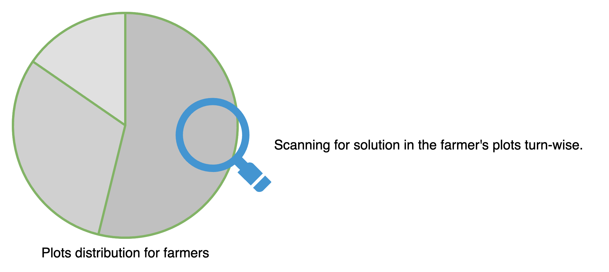

# farm

This is a chapter about farming. It contains code snippets and functions that can be used to farm. Here, we would be demystifying the `farm` command and understand how farming works. The code snippets are taken from the [pulsar](https://github.com/subspace/pulsar) repository.

TODO: verify this understanding: <br/>
Farming is the process of generating proofs of space. It is the process of generating a proof that you have allocated a certain amount of disk space to the network. The (part of) blockchain data that is supposed to be stored in the disk space by farmer is calculated such that there is max. data availability. And then a cryptographic solution is scanned in the disk spaces of the farmers and winner is chosen likewise.



## Usage

When you run `pulsar farm` command, this would be the output:

```bash
$ pulsar farm
Starting node ...
Node started successfully!
 ◝  [00:03:19] 30% [] (377167/1253106) 0.00bps, syncing, ETA: 1868832633d 13:46:45 
```

it's at the initial stage of syncing the node with the network w.r.t blocks. Here, the node is syncing with the network and the ETA is calculated based on the current speed of syncing.

> NOTE: There is no farmer instance yet running. So, no farmer until and unless the node is synced with the network.

Now, if you want to see the `node` folder details:

```bash
~/Library/Application Support/pulsar  
❯ tree -L 7 
.
├── node
│   ├── chains
│   │   └── subspace_gemini_3g
│   │       ├── network
│   │       │   └── secret_ed25519
│   │       └── paritydb
│   │           └── full
│   │               ├── index_00_16
│   │               ├── index_01_16
│   │               ├── lock
│   │               ├── log2
│   │               ├── metadata
│   │               ├── table_00_00
│   │               ├── table_00_17
│   └── known_addresses.bin
└── settings.toml
```

And then once, we have the node synced, the farmer instance would be running. And then we would get to see `farms` folder.<br/>
TODO: add terminal output for `farms` folder.

## Demystify

There is a function - `farm` that is responsible for farming.

```rust
// Source code: https://github.com/subspace/pulsar/blob/d55065a9991caac27286c14b9e5977ca3025fa3d/src/commands/farm.rs#L37-L38
pub(crate) async fn farm(is_verbose: bool, enable_domains: bool, no_rotation: bool) -> eyre::Result<()> {
    // ...
}
```

It takes three arguments:

- `is_verbose`: Controls the verbosity of the logging output.
- `enable_domains`: A flag that, when enabled, configures the node to use domain-specific settings.
- `no_rotation`: Although not directly related to farming, this flag impacts how logging is handled.

### What is the minimum space (aka farm size) required to farm?

The minimum space required to farm is set to `2 GB`, which is defined as a constant `MIN_FARM_SIZE`. Same as the default space to farm.

Here is the code snippet:

```rust
// Source code: https://github.com/subspace/pulsar/blob/d55065a9991caac27286c14b9e5977ca3025fa3d/src/config.rs#L17-L18
pub(crate) const DEFAULT_FARM_SIZE: ByteSize = ByteSize::gb(2);
pub(crate) const MIN_FARM_SIZE: ByteSize = ByteSize::gb(2);
```

### How is farming process initiated?

1. The farming process is initiated after ensuring that no other farming instances are running.
2. It then proceeds to validate the configuration, apply any advanced options (such as `enable_domains`), and start the farmer and node instances.
3. The farming process also includes subscription to plotting progress and new solutions, with the behavior adjusted based on the verbosity level. Meaning when a farming process in initiated, if stopped, it can be resumed from the same point using the `FarmDescription` struct's `path` field. [Code](https://github.com/subspace/subspace-sdk/blob/000c6c774f3dd995e783d6d78d1d59669540b454/farmer/src/lib.rs#L56-L59). Also, whenever there is a new farm solution (computed mathematically).

### How is single instance check ensured?

```rust
// Source code: https://github.com/subspace/pulsar/blob/d55065a9991caac27286c14b9e5977ca3025fa3d/src/commands/farm.rs#L42-L49

pub(crate) const SINGLE_INSTANCE: &str = ".subspaceFarmer";

pub(crate) async fn farm(is_verbose: bool, enable_domains: bool, no_rotation: bool) -> eyre::Result<()> {
    // ...

    let instance = SingleInstance::new(SINGLE_INSTANCE)
        .context("Cannot take the instance lock from the OS! Aborting...")?;
    if !instance.is_single() {
        return Err(eyre!(
            "It seems like there is already a farming instance running. Aborting...",
        ));
    }
}
```

Here, a file `.subspaceFarmer` is created using `SingleInstance::new()` function with some value in it when farming. This is how the single instance check is done.
