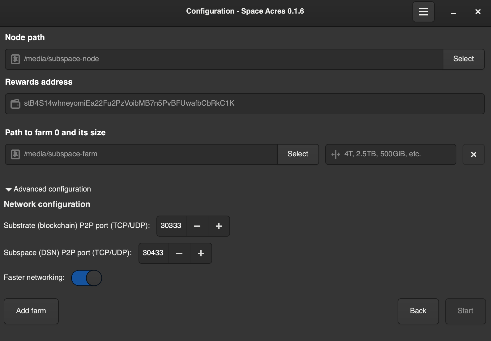

# Space Acres

## GUI

### Config page



## CLI

For macOS, simply run:

```sh
cargo r -r
# OR
./target/release/space-acres
```

To see more logs, do this:

```sh
RUST_LOG=info,subspace_service=trace cargo r -r
# OR
# use this if want to use the release build without any new code changes.
RUST_LOG=info,subspace_service=trace ./target/release/space-acres
```
